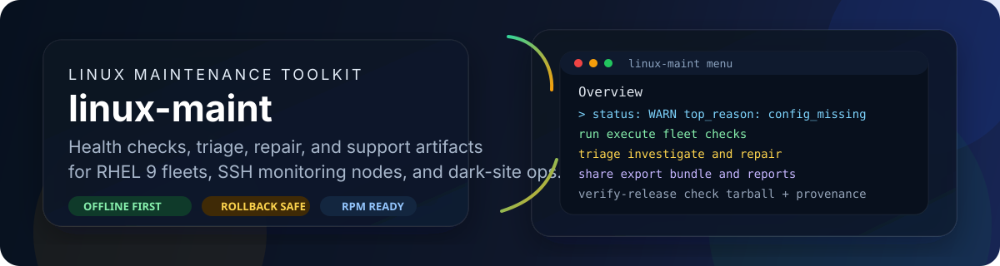
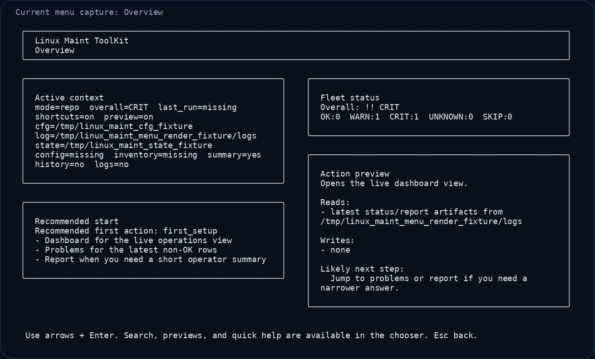
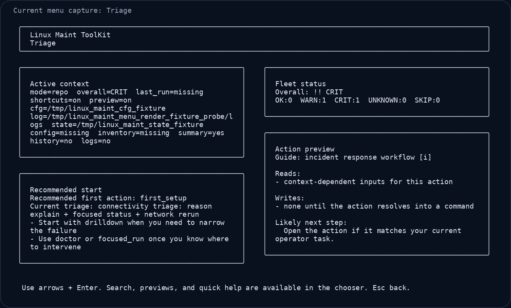

# Linux Maintenance Toolkit

<p align="center">
  
</p>

<p align="center">
  <a href="https://github.com/ShenhavHezi/Linux_Maint_ToolKit/actions/workflows/ci.yml">
    
  </a>
  <a href="https://github.com/ShenhavHezi/Linux_Maint_ToolKit/releases/latest">
    
  </a>
  <a href="LICENSE">
    
  </a>
  
  
</p>

<p align="center">
  <strong>Offline-first Linux health, triage, and maintenance for real operators.</strong><br>
  Run from a repo checkout or install system-wide. Built for RHEL 9, SSH-based fleet checks, and air-gapped environments.
</p>

<p align="center">
  <a href="#quick-start">Quick start</a>
  ·
  <a href="#operator-workflow">Operator workflow</a>
  ·
  <a href="#documentation-map">Documentation map</a>
  ·
  <a href="docs/QUICK_REFERENCE.md">Quick reference</a>
  ·
  <a href="docs/UPGRADE.md">Upgrade guide</a>
</p>

## Why Teams Use `linux-maint`

- One operator surface for `run`, `status`, `triage`, `repair`, and `export`.
- Stable machine-readable contracts for automation and human-readable output for on-call work.
- Repo mode for development and safe testing, installed mode for scheduled operations.
- Dark-site friendly by default: no runtime network dependency.
- Built-in support bundle, release verification, rollback-aware upgrades, and RPM packaging.
- Arrow-first interactive menu for fast incident handling without memorizing commands.

## Quick Start

Choose the path that matches how you want to operate.

### Repo Mode

Best for development, validation, and running from a monitoring node.

```bash
git clone https://github.com/ShenhavHezi/Linux_Maint_ToolKit.git
cd Linux_Maint_ToolKit
./bin/linux-maint check
./run_full_health_monitor.sh
./bin/linux-maint status
./bin/linux-maint menu
```

### Installed Mode

Best for persistent hosts, timers, and system-wide operations.

```bash
sudo ./install.sh --with-user --with-timer --with-logrotate
sudo linux-maint init --minimal
sudo linux-maint check
sudo linux-maint run
sudo linux-maint status
sudo linux-maint menu
```

### Air-Gapped / Dark-Site

Use the release tarball or RPM flow with verification first.

```bash
tarball="$(ls dist/Linux_Maint_ToolKit-v*.tgz | tail -n1)"
bash tools/verify_release.sh "$tarball" \
  --sums dist/SHA256SUMS \
  --manifest dist/release_provenance.json
sudo linux-maint upgrade "$tarball"
```

Start with [installation](docs/installation.md), [dark-site guidance](docs/DARK_SITE.md), and [upgrade/rollback](docs/UPGRADE.md) if you are deploying onto managed systems.

## What `linux-maint` Gives You

| Area | What you get |
| --- | --- |
| Health checks | Structured `OK/WARN/CRIT` results with stable `monitor=... host=... status=... reason=...` summary lines |
| Operator UX | Clean CLI plus an interactive menu for `Overview`, `Run`, `Triage`, and `Share` workflows |
| Automation | JSON outputs, Prometheus export, status contracts, predictable exit behavior |
| Release safety | Release verification, provenance manifest, rollback-aware install and upgrade flow |
| Supportability | Built-in logs, history, diffs, doctor checks, and support bundle packaging |
| Environments | Repo mode, installed mode, SSH fleet operation, offline and dark-site deployment |

## Operator Workflow

Most teams use the toolkit in this order:

1. **Check readiness** with `linux-maint check` or `linux-maint doctor`.
2. **Run health collection** with `linux-maint run` or `./run_full_health_monitor.sh`.
3. **Triage the result** with `linux-maint status`, `summary`, `report`, `diff`, or `menu`.
4. **Repair and verify** with the guided `Triage` flow, targeted commands, and another `check`.
5. **Share artifacts** with `linux-maint pack-logs`, JSON export, or the release-aware support bundle flow.

If you prefer the menu, start with:

- `linux-maint menu`
- `Quickstart` for first setup and incident entry
- `Overview` for current state
- `Triage` for guided drilldown and recovery
- `Share` for reports, JSON, metrics, and support bundles

## See The Menu

<p align="center">
  
  
</p>

These are current captures rendered from the real menu frame output in the test fixtures, not concept art.

The menu is designed around the same operator flow as the CLI and docs:

- `Quickstart` for first setup and incident entry
- `Overview` for current health and top reasons
- `Triage` for guided drilldown and repair decisions
- `Share` for reports, metrics, and support bundles

## Commands You Will Use Often

| Command | Why you use it |
| --- | --- |
| `linux-maint check` | Validate config, paths, and prerequisites before a real run |
| `linux-maint run` | Execute the main health and maintenance collection flow |
| `linux-maint status --verbose` | See the latest state quickly with reasons and counters |
| `linux-maint report` | Produce a fuller operator-facing summary |
| `linux-maint diff` | Compare current and previous summaries |
| `linux-maint doctor` | Investigate setup drift and environment issues |
| `linux-maint pack-logs` | Create a support-ready bundle with metadata and handoff notes |
| `linux-maint verify-release <tarball>` | Validate a release artifact before install or upgrade |
| `linux-maint upgrade <tarball>` | Perform a verified, rollback-aware tarball upgrade |

## Designed For Real Constraints

- **RHEL 9 first** with compatible CI coverage across Debian 12, Ubuntu 24.04, and Rocky Linux 9.
- **Air-gapped safe** with no runtime network requirement.
- **Automation-friendly** because machine output stays parse-safe and stable.
- **Human-friendly** because CLI help, menu guidance, and support flows are explicit.
- **Fleet-ready** because the same toolkit works locally or over SSH against multiple hosts.

## Documentation Map

| If you need to... | Start here |
| --- | --- |
| Get oriented quickly | [docs/README.md](docs/README.md) |
| Find the most common commands | [docs/QUICK_REFERENCE.md](docs/QUICK_REFERENCE.md) |
| Install on a host | [docs/installation.md](docs/installation.md) |
| Upgrade or roll back safely | [docs/UPGRADE.md](docs/UPGRADE.md) |
| Work in a dark-site environment | [docs/DARK_SITE.md](docs/DARK_SITE.md) |
| Understand commands and JSON contracts | [docs/reference.md](docs/reference.md) |
| Configure inventory and settings | [docs/configuration.md](docs/configuration.md) |
| Triage common failures | [docs/troubleshooting.md](docs/troubleshooting.md) |
| Understand release artifacts | [docs/ARTIFACTS.md](docs/ARTIFACTS.md) |

## Compatibility

Primary target: **RHEL 9**.

Also covered in CI:

- Debian 12
- Ubuntu 24.04
- Rocky Linux 9 as the RHEL 9 compatible RPM lane

Minimum tooling:

- bash 4.2+
- coreutils, `awk`, `sed`, `grep`
- `openssh-client` for SSH mode
- `python3` for JSON tooling and contract verification

## Testing

```bash
bash tests/smoke.sh
bash tests/summary_contract.sh
make quick-check
```

For release work:

```bash
bash tools/release_check.sh
bash tools/release_audit.sh
```

## Support

When reporting a problem, include:

- `linux-maint` version and whether you are in repo mode or installed mode
- distro and shell version
- `linux-maint status --verbose`
- `linux-maint logs 200`
- a support bundle from `linux-maint pack-logs`

Security issues should follow [SECURITY.md](SECURITY.md).
