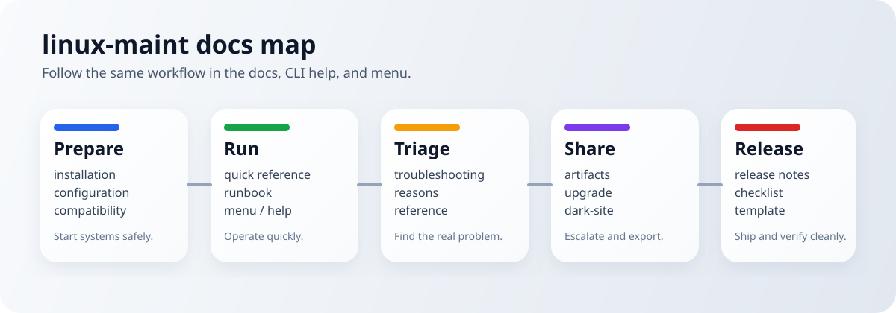
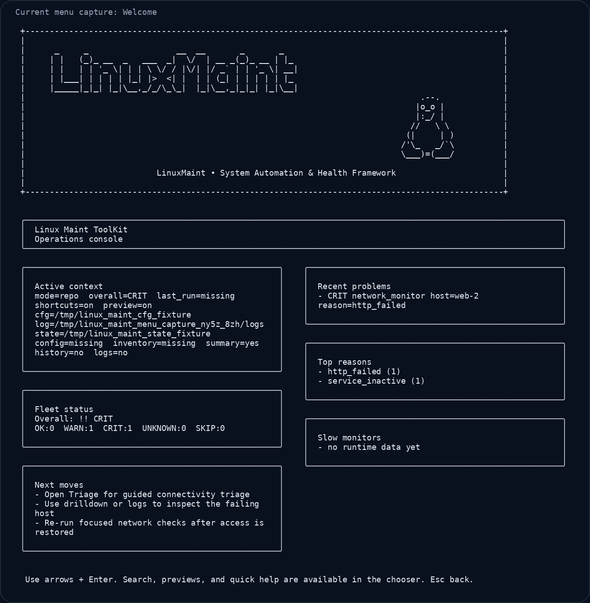

# Documentation Hub

This is the fastest way to navigate `linux-maint` without guessing which file matters.

## Menu preview

  

This GIF is rendered from the real menu frame output in the repo fixtures.

## Start Here

| If you want to... | Open this |
| --- | --- |
| Understand what the toolkit does | [../README.md](../README.md) |
| Get through the first useful run fast | [FIRST_5_MINUTES.md](FIRST_5_MINUTES.md) |
| Get the most common commands fast | [QUICK_REFERENCE.md](QUICK_REFERENCE.md) |
| Install on a host | [installation.md](installation.md) |
| Upgrade or roll back safely | [UPGRADE.md](UPGRADE.md) |
| Work in an air-gapped environment | [DARK_SITE.md](DARK_SITE.md) |
| Understand every command and JSON contract | [reference.md](reference.md) |
| Troubleshoot an active problem | [troubleshooting.md](troubleshooting.md) |

## Operator Workflow

Use this order if you are operating the toolkit on a real system.

1. **Prepare**
   Open [installation.md](installation.md), [configuration.md](configuration.md), and [COMPATIBILITY.md](COMPATIBILITY.md).
2. **Run**
   Start with [FIRST_5_MINUTES.md](FIRST_5_MINUTES.md), [QUICK_REFERENCE.md](QUICK_REFERENCE.md), or `linux-maint menu`.
3. **Triage**
   Use [troubleshooting.md](troubleshooting.md), [REASONS.md](REASONS.md), [RUNBOOK.md](RUNBOOK.md), and [DAY2.md](DAY2.md).
4. **Export and escalate**
   Use [ARTIFACTS.md](ARTIFACTS.md), [UPGRADE.md](UPGRADE.md), and [FAQ.md](FAQ.md).

## Pick By Task

### Get productive quickly

- [FIRST_5_MINUTES.md](FIRST_5_MINUTES.md)
- [QUICK_REFERENCE.md](QUICK_REFERENCE.md)
- [RUNBOOK.md](RUNBOOK.md)
- [FAQ.md](FAQ.md)

### Set up or change configuration

- [configuration.md](configuration.md)
- [installation.md](installation.md)
- [COMPATIBILITY.md](COMPATIBILITY.md)
- [OPERATIONS.md](OPERATIONS.md)
- [CUSTOM_MONITORS.md](CUSTOM_MONITORS.md)

### Investigate results and reasons

- [troubleshooting.md](troubleshooting.md)
- [REASONS.md](REASONS.md)
- [reference.md](reference.md)
- [MONITORS_MATRIX.md](MONITORS_MATRIX.md)

### Work offline or ship artifacts

- [DARK_SITE.md](DARK_SITE.md)
- [ARTIFACTS.md](ARTIFACTS.md)
- [UPGRADE.md](UPGRADE.md)
- [release_notes/README.md](release_notes/README.md)
- Release notes (latest): `docs/release_notes/release_notes_v0.3.9.md`, `docs/release_notes/release_notes_v0.3.8.md`

## Menu and CLI Help

- `linux-maint help`
- `linux-maint help menu`
- `linux-maint menu`
- [TUI_STYLE_GUIDE.md](TUI_STYLE_GUIDE.md)

The menu follows the same flow as the docs:

- `Quickstart`
- `Overview`
- `Run`
- `Triage`
- `Share`

## Contributors and Maintainers

| Topic | Start here |
| --- | --- |
| Contributing rules | [../CONTRIBUTING.md](../CONTRIBUTING.md) |
| Maintainer rules | [../.github/MAINTAINER_RULES.md](../.github/MAINTAINER_RULES.md) |
| Roadmap | [ROADMAP.md](ROADMAP.md) |
| Command contract checklist | [COMMAND_CONTRACT_CHECKLIST.md](COMMAND_CONTRACT_CHECKLIST.md) |
| Release process | [RELEASE_CHECKLIST.md](RELEASE_CHECKLIST.md) |
| Release note format | [RELEASE_TEMPLATE.md](RELEASE_TEMPLATE.md) |
| Release history | [release_notes/README.md](release_notes/README.md) |
| Plugin extension work | [PLUGIN_SDK.md](PLUGIN_SDK.md) |
| Security handling | [../SECURITY.md](../SECURITY.md), [SECURITY_RESPONSE.md](SECURITY_RESPONSE.md) |
| Audits and reports | [reports/README.md](reports/README.md) |

## Reference Shelf

- [reference.md](reference.md)
- [architecture.md](architecture.md)
- [examples/README.md](examples/README.md)
